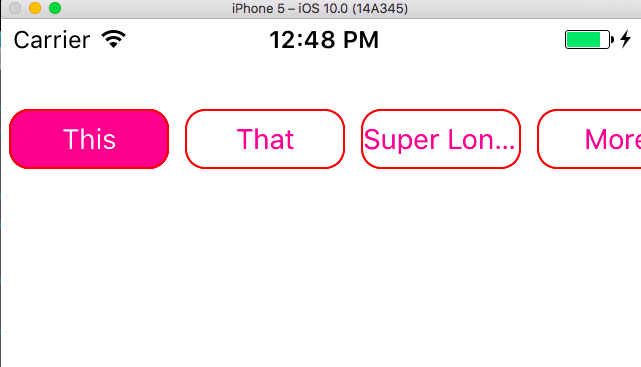

# RN-Search-Option-Bar
<br>

* `npm install rn-search-option-bar --save`

<br>

### Prop

| Prop | Type | Description | Required |
| ---  | ---  | ---         | ---      |
| options | Array of Strings | The options listed in the buttons | **YES** |
| onPress | function | the function called when the button is pressed, called with the string as the argument | **YES** |
| buttonStyle | object | styles applied to the buttons | **YES** |
| containerStyle | object | styles applied to the container | **YES** |
| showsHorizontalScrollIndicator | boolean | show the scroll indicator | no |

#### How it works

* The first option shows as selected by default
* The `buttonStyle` `backgroundColor` will be applied to the selected option
* The `containerStyle` `backgroundColor` will be applied to the text of the selected option.

So at minimum, I suggest `containerStyle={{backgroundColor:'white'}}` and `buttonStyle={{borderWidth:1,backgroundColor: 'something'}}`




```js
import React, { Component } from 'react';


import SearchOptionBar from 'rn-search-option-bar';

class SearchOptionBarExample extends Component {
  render(){
    return(
      <SearchOptionBar
        options={
          ['This','That','Super Long Option Cut Off Because Of Fixed Button Width', 'More', 'Stuff', 'To', 'Do']
        }
        onPress={
          (option) => console.log('You Pressed ' + option)
        }
        containerStyle={{
          backgroundColor:'white',
          height:60,
        }}
        buttonStyle={{
          borderWidth:1,
          borderRadius:10,
          borderColor: 'red',
          height: 30,
          width: 80,
          backgroundColor: 'deeppink'
        }}
        showsHorizontalScrollIndicator={true}
        />
    )
  };

}
```
